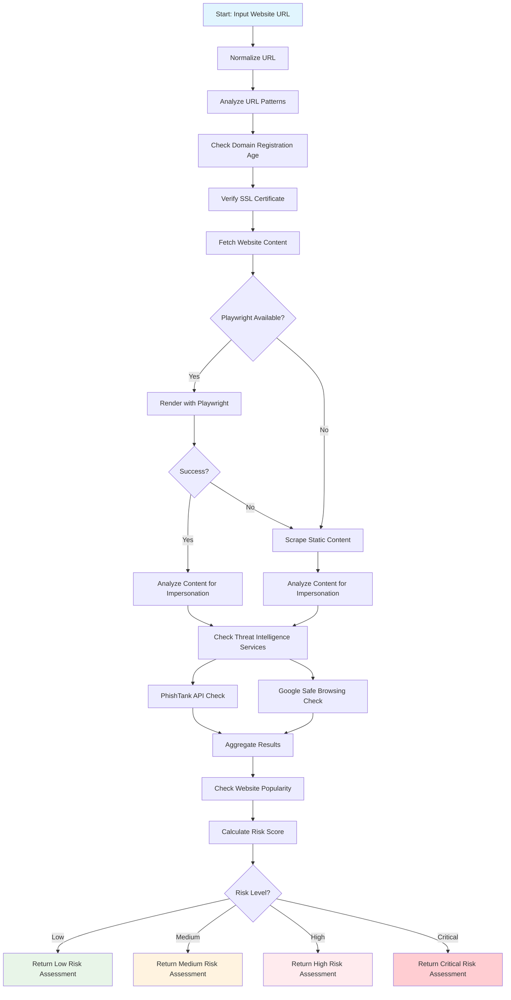

# Website Fraud Check Skill

A skill for detecting potentially fraudulent websites by analyzing various indicators including URL patterns, domain information, SSL certificates, and website content.

## Features

- 🔍 URL pattern analysis for suspicious elements
- 📅 Domain age verification
- 🔒 SSL certificate validation
- 📄 Static and dynamic content analysis
- 🎭 Brand impersonation detection
- 🛡️ Threat intelligence feed checking
- 📊 Risk scoring and assessment

## Prerequisites

### Basic Requirements
- Node.js
- Internet connectivity
- whois (install with: `sudo apt install whois` or `brew install whois`)

### Enhanced Detection (Optional but Recommended)
For improved detection of dynamically-rendered websites (those that update HTML DOM after page load), install Playwright:

```bash
npm install --save playwright
npx playwright install chromium
```

> **Note**: With Playwright, the system can:
> - Render JavaScript-heavy websites
> - Detect content that loads dynamically
> - Identify more sophisticated phishing attempts
> - Improve impersonation detection accuracy

## Installation

1. Ensure Node.js is installed on your system
2. (Optional) Install Playwright for enhanced detection: `npm install --save playwright && npx playwright install chromium`

## Usage

This skill is designed to be used by agentic AI systems like OpenClaw. The primary interface is through the OpenClaw skill system.

When invoked by OpenClaw, the skill will analyze the provided website URL and return a comprehensive fraud risk assessment.

Example usage within OpenClaw:
```
check if [website_url] is fraudulent
is [website_url] safe to visit?
analyze [website_url] for scams
```

The skill can also be run directly:
```bash
node scripts/website_fraud_check.mjs <website_url>
```

Example:
```bash
node scripts/website_fraud_check.mjs https://example.com
```

## Risk Levels

- 🟢 **LOW (0-14)**: Appears safe, exercise normal caution
- 🟠 **MEDIUM (15-29)**: Exercise caution, verify legitimacy
- 🟡 **HIGH (30-49)**: Exercise extreme caution
- 🔴 **CRITICAL (50+)**: Do not trust, avoid entering information

## How It Works

The system evaluates websites based on multiple factors:

1. **URL Analysis**: Checks for suspicious patterns and structures
2. **Domain Age**: New domains (less than 1 year) receive higher risk scores
3. **SSL Verification**: Ensures secure connections
4. **Content Analysis**: Scans for brand impersonation and suspicious elements
   - **Static Content**: Direct HTML parsing for standard websites
   - **Dynamic Content**: Uses Playwright to render JavaScript-heavy sites before analysis
5. **Threat Intelligence**: Checks against known malicious sites
6. **Website Popularity**: Checks against Tranco popularity list to reduce risk for well-known sites



## Detection Capabilities

The skill can detect:
- Phishing websites mimicking legitimate services
- Recently registered domains
- Sites with invalid SSL certificates
- Websites containing suspicious keywords
- Impersonation of well-known brands/services
- Suspicious URL structures
- Known phishing sites from threat intelligence feeds (with API integration)

## Threat Intelligence Integration

The skill integrates with multiple threat intelligence services:

- **PhishTank API**: Checks against known phishing sites (no API key required for basic lookups)
- **Google Safe Browsing API**: Checks against Google's list of unsafe websites (requires API key)

### Service Status Reporting

When running the tool, you'll see a status report showing which threat intelligence services are active:

```
Threat Intelligence Service Status:
  PhishTank: Active - Basic lookups available without API key
  Google Safe Browsing: Inactive - Missing GOOGLE_SAFE_BROWSING_API_KEY environment variable
```

### Setup for Enhanced APIs

To enable Google Safe Browsing API:
1. Register for an API key at https://developers.google.com/safe-browsing/
2. Set the environment variable: `GOOGLE_SAFE_BROWSING_API_KEY=your_api_key_here`

### PhishTank Integration

The system uses HTTP POST requests to check URLs against the PhishTank database:
1. Register for an API key at https://www.phishtank.com/api_info.php (optional but recommended)
2. The API call could fail when Cloudflare trying to perform human verification

## Limitations

- May occasionally flag legitimate new sites
- Cannot detect all sophisticated social engineering tactics
